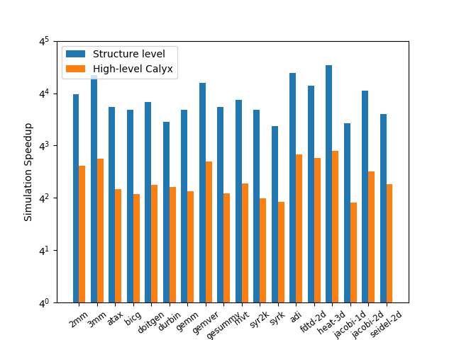

# Artifact Evaluation of Hestia

This repository contains the evaluation materials for our MICRO 2024 paper entitled "Hestia: An Efficient Cross-level Debugger for High-level Synthesis".

# Setup

## Install Rust

```bash
curl https://sh.rustup.rs -sSf | sh
```

## Build Hestia

```bash
git clone https://github.com/pku-liang/hestia.git
cargo build --all --release
```

# Cider Setup

## Install python dependencies

```bash
python3 -m pip install numpy flit prettytable wheel hypothesis pytest simplejson matplotlib scipy seaborn
```

## Build Calyx and Cider

```bash
git clone https://github.com/cucapra/calyx.git calyx
cd calyx
git checkout cider-eval # important !!!
cargo build --all --release
```

## Install Fud

```bash
cd calyx # go to the calyx directory from the prior step
cd fud
flit install --symlink # make sure this is in your path
```

Now you need to configure fud. Fill in `PATH/TO/CALYX`  with
the appropriate values for your installation

```bash
fud config global.futil_directory 'PATH/TO/CALYX' && \
fud config stages.futil.exec 'PATH/TO/CALYX/target/release/futil' && \
fud config stages.interpreter.exec 'PATH/TO/CALYX/target/release/interp' && \
fud register icarus-verilog -p 'PATH/TO/CALYX/fud/icarus/icarus.py' && \
fud config stages.interpreter.flags " --no-verify " # the spaces are important
```

# Evaluation data

Set the path of Hestia in ``data.py``

```python
debugger = "~/hector-debugger/target/release/hector-debugger "
```

Use the python script to run the evaluation and to generate three csv files. (Table III, Table IV, Fig 8)

```bash
python3 data.py
```

# Generate figure

```bash
python3 figure.py
```

The generated figure ``figure.png`` looks like this:
